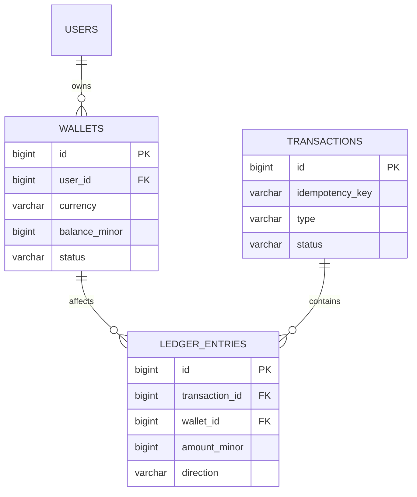

<div align="center">

# 💰 SuperWallet

### A production-grade fintech backend built from first principles

*Double-entry ledger · Idempotent transactions · Integer-precise money handling*

<br/>

[](https://www.python.org/)
[](https://fastapi.tiangolo.com/)
[](https://www.postgresql.org/)
[](https://redis.io/)
[](https://www.docker.com/)
[](LICENSE)

[](https://alembic.sqlalchemy.org/)
[](https://github.com/hynek/argon2-cffi)
[](https://pyauth.github.io/pyotp/)
[](CONTRIBUTING.md)

</div>

---

## 📑 Table of contents

- [Overview](#-overview)
- [Core principles](#-core-principles)
- [Tech stack](#-tech-stack)
- [Architecture](#-architecture)
- [Identity & Auth (built so far)](#-identity--auth-built-so-far)
- [Project structure](#-project-structure)
- [Data model](#-data-model)
- [Design decisions](#-design-decisions)
- [Getting started](#-getting-started)
- [Roadmap](#-roadmap)
- [Known issues](#-known-issues)
- [Development philosophy](#-development-philosophy)

---

## 🔎 Overview

**SuperWallet** is a digital wallet backend built to explore how real financial systems are engineered — not by copying tutorials, but by reasoning through every architectural decision from the ground up: why a ledger exists, why money is never stored as a float, why concurrent transfers need explicit lock ordering, and why idempotency isn't optional in payment systems.

The project is being built in three deliberate stages, each fully understood and hardened before moving to the next:

| Stage | Scope | Status |
|:---:|---|:---:|
| **0️⃣ Identity & Auth** | Registration, email verification, login (lockout + TOTP 2FA), refresh-token rotation, sessions, password reset, audit log | 🚧 In progress |
| **1️⃣ Fiat ledger** | Wallets, double-entry transactions, deposit/withdrawal/transfer | ⏳ Not started |
| **2️⃣ Card vault** | Stripe tokenization, card-funded deposits | ⏳ Planned |
| **3️⃣ Crypto wallets** | HD wallet derivation (BIP32/39/44), on-chain balance tracking | ⏳ Planned |

> Stage 0 wasn't in the original plan — it turned out identity/session security needed to be solid *before* money movement could be built on top of it. The ledger invariants below (atomicity, idempotency, auditability) still apply; they just haven't been implemented in code yet.

---

## ⚙️ Core principles

Every wallet operation in this system is designed to satisfy five invariants:

- ⚛️ **Atomicity** — a transaction either fully succeeds or fully rolls back. No partial money movement.
- 🔁 **Idempotency** — retrying the same request never double-charges or double-sends.
- ✅ **Consistency** — the cached wallet balance can never silently drift from the ledger's source of truth.
- 🧾 **Auditability** — every balance is explainable by replaying its ledger history. Nothing is ever deleted or overwritten.
- 🔢 **Decimal precision** — money is stored as integers in minor units (e.g. cents/teňňe), never as floating point, to eliminate rounding error by construction.

---

## 🧱 Tech stack

| Layer | Choice | Why |
|---|---|---|
| API framework | **FastAPI** | Async-native, dependency injection via `Depends()` |
| Database driver | **asyncpg** (raw SQL, no ORM) | Full control over query shape, locking, and transaction boundaries — critical for ledger correctness |
| Database | **PostgreSQL** | Row-level locking (`FOR UPDATE`), strong consistency guarantees |
| Password hashing | **Argon2** (`argon2-cffi`) | Winner of the Password Hashing Competition; memory-hard, resists GPU cracking better than bcrypt |
| 2FA | **PyOTP** (TOTP) | Standard RFC 6238 time-based codes; secret stored encrypted at rest (`cryptography`) |
| Async event delivery | **Transactional outbox** (own `outbox_events` table + polling worker) | Writing the "send this email" event in the *same* DB transaction as the business change avoids the classic dual-write bug (DB commits, but the message broker publish fails or vice versa) |
| Migrations | **Alembic** | Versioned, reviewable schema history |
| Orchestration | **Docker Compose** | Local parity across services (`api`, `notification_worker`, `db`, `redis`) |
| Broker / cache | **Redis** | Provisioned in `docker-compose.yml`; not yet consumed by any service — reserved for session/rate-limit caching or a future move off the DB-polling outbox worker |
| Background jobs | **Celery** | Listed as a dependency; the notification worker currently runs as a plain `asyncio` polling loop (`app/notifications/worker.py`), not as Celery tasks — pick one and drop the other before this grows |

> **CI/CD:** not yet configured — no `.github/workflows/` in the repo. Worth adding once the test suite has real coverage.

---

## 🏗️ Architecture

SuperWallet follows a **modular monolith** design — a single deployable service, internally organized by business domain rather than by technical layer.

```
Client
  │  HTTP request (with idempotency key)
  ▼
FastAPI router          → validates request shape (Pydantic)
  ▼
Service layer           → business rules: locking order, balance checks, invariants
  ▼
Repository layer        → raw SQL, one asyncpg.Connection per transaction
  ▼
PostgreSQL              → single BEGIN…COMMIT: transactions + ledger_entries + wallets
```

> **Why modular monolith over microservices, for now:** the fiat, card, and crypto domains share tight transactional correctness requirements (e.g. a card-funded deposit must atomically update both the ledger and the wallet balance). Splitting into separate services before those boundaries are proven would introduce distributed-transaction complexity without a corresponding benefit at current scale. Each domain is still developed as an isolated module (`app/fiat`, `app/cards`, `app/crypto`) so it can be extracted into its own service later with minimal rework.

---

## 🔐 Identity & Auth (built so far)

Before any money can move, the system needs to know *who* is asking and be confident that knowledge can't be stolen or replayed. This is what's implemented today:

| Feature | Notes |
|---|---|
| **Registration** | Unique email + username enforced at the service layer; Argon2 password hash; fires an `email_verification` event via the outbox |
| **Login** | Account lockout after repeated failures; transparent rehash-on-login if password parameters are outdated; TOTP required if 2FA is enabled |
| **2FA (TOTP)** | RFC 6238 codes via PyOTP; secret encrypted at rest |
| **Sessions** | Refresh token stored **hashed** in `sessions`, delivered to the client as an `HttpOnly`, `Secure`, `SameSite=Strict` cookie scoped to `/auth` — access token stays in the response body only, never in browser storage |
| **Refresh rotation + reuse detection** | Every refresh call rotates the token; presenting an *already-rotated* (stolen) token revokes every session for that user — a possible-theft signal, not just an expiry |
| **Email verification / password reset** | Token-based flows; responses are deliberately generic ("if this email is registered…") to avoid leaking account existence |
| **Audit log** | Every security-relevant event (`login_success`, `login_failed`, `refresh_token_reuse_detected`, etc.) is written in the *same transaction* as the action it describes |
| **Profile (`/users/me`)** | 🚧 Partially built — repository methods for update/delete exist, but the router/service/schema files are still empty stubs and nothing is registered in `main.py` yet |

> **Why session-based refresh over plain stateless JWT refresh:** storing sessions in Postgres is what makes reuse detection and "revoke all my other devices" possible at all. A stateless refresh JWT can't be individually revoked before it expires.

---

## 📁 Project structure

```
super-wallet/
├── migrations/                    # Alembic — versioned schema history
│   └── versions/                    # users, verification_tokens, sessions,
│                                     # audit_logs, outbox_events tables so far
├── app/
│   ├── main.py                    # FastAPI app assembly, router registration
│   ├── core/
│   │   ├── config.py                # Environment-based settings
│   │   ├── database.py              # Connection pool lifecycle (lifespan-managed)
│   │   ├── security.py               # Shared crypto helpers
│   │   ├── audit.py                  # log_audit_event() — one INSERT, called from services
│   │   ├── outbox.py                 # OutboxRepository — domain-agnostic event queue
│   │   └── exceptions.py             # (currently empty — see Known issues)
│   ├── users/                      # Everything identity/auth — the only fleshed-out domain
│   │   ├── dependencies.py           # get_current_user, etc.
│   │   ├── exception.py              # AppError → AuthError hierarchy + EXCEPTION_REGISTRY
│   │   ├── exception_handlers.py
│   │   ├── security.py               # Argon2, TOTP, refresh-token hashing
│   │   ├── repository.py             # UserRepository, SessionRepository, VerificationTokenRepository
│   │   ├── router/
│   │   │   ├── auth.py                 # register / login / logout / refresh
│   │   │   ├── session_auth.py         # verify-email, password reset, session list/revoke
│   │   │   ├── profile.py              # 🚧 empty stub
│   │   │   └── admin.py                # 🚧 empty stub
│   │   ├── services/
│   │   │   ├── auth.py                 # Register/Login/Refresh/Logout use-cases
│   │   │   ├── session_auth.py         # Email verification, password reset, session mgmt
│   │   │   ├── profile.py              # 🚧 empty stub
│   │   │   └── admin.py                # 🚧 empty stub
│   │   └── schemas/                  # mirrors router/ — auth.py + session_auth.py in use
│   ├── notifications/               # Outbox consumer
│   │   ├── worker.py                  # asyncio polling loop (see Tech stack note on Celery)
│   │   ├── handlers/                  # event_type → handler dispatch
│   │   └── providers/                 # actual email-sending backend
│   ├── fiat/                       # Stage 1 — router/service/repo/schemas all empty stubs
│   ├── cards/                      # Stage 2 — not started
│   └── crypto/                     # Stage 3 — not started
├── tests/
├── docker-compose.yml               # api, notification_worker, db, redis
├── pyproject.toml
└── requirements.txt                 # duplicates pyproject.toml — see Known issues
```

Each domain is meant to own its full vertical slice — router, service, repository, schemas — so that changing one domain's rules never touches another's. Right now `users/` is the only domain that fully lives up to that; `fiat/cards/crypto` are placeholders waiting for Stage 1.

---

## 🗃️ Data model

### What actually exists today (migrations applied)

- **`users`** — email, username, Argon2 password hash, lockout counters, TOTP secret (encrypted)
- **`verification_tokens`** — email verification + password reset tokens
- **`sessions`** — hashed refresh tokens, device info, rotation lineage (for reuse detection)
- **`audit_logs`** — append-only security event log, keyed to `user_id` where known
- **`outbox_events`** — generic `event_type` + JSON `payload` + delivery status, consumed by `notifications/worker.py`

### Stage 1 target schema (fiat ledger — not yet migrated)



- **`wallets`** — one row per (user, currency). `balance_minor` is a denormalized cache, always updated in the same transaction as its ledger entries — never independently.
- **`transactions`** — the event: what happened, its type (`deposit` / `withdrawal` / `transfer`), and its lifecycle status. Carries the `idempotency_key`.
- **`ledger_entries`** — the immutable, append-only record of money movement. Every transaction produces one or more entries; a `transfer` always produces exactly two (`debit` + `credit`), whose amounts sum to zero.

> Once `wallets` exists, `users.id` should be the FK target for it — which is exactly why the hard-delete on `users` flagged in [Known issues](#-known-issues) needs to be resolved *before* Stage 1 starts, not after.

---

## 🧠 Design decisions

A few decisions worth calling out, since each was chosen over a simpler-looking alternative for a specific reason:

- 🔢 **Integer minor units, not `DECIMAL`/`float`** — storing `10050` instead of `100.50` sidesteps binary floating-point rounding error entirely (`0.1 + 0.2 !== 0.3` in IEEE 754). Arithmetic on integers is exact by construction.
- 📜 **Ledger is append-only** — balances are never edited in place. Corrections are made with a new, opposite-direction entry, preserving a complete audit trail.
- 🔐 **Idempotency keys are enforced at the database level** (`UNIQUE` constraint), not just in application code — closing the race-condition window where two near-simultaneous retries both pass an application-level check.
- 🔒 **Deterministic lock ordering for transfers** — when a transfer locks two wallet rows, it always locks the lower `id` first. This makes deadlocks between concurrent opposite-direction transfers structurally impossible, rather than something retried around.
- 🧩 **Repositories receive a single `asyncpg.Connection`, not the pool** — a transaction's `BEGIN…COMMIT` boundary must live on one connection; letting each repository call `pool.acquire()` independently makes it impossible to compose multiple writes into one atomic operation.
- 🔑 **Password policy is length-only (8–128 chars), no forced complexity rules** — per NIST 800-63B, mandatory "uppercase+digit+symbol" rules measurably push users toward predictable patterns (`Password1!`) rather than stronger ones. A denylist of known-weak passwords is checked instead.
- 📬 **Outbox pattern for email, not a direct SMTP call in the request path** — the "user registered" DB write and the "send verification email" side-effect must be atomic. Writing both in one transaction and letting a separate worker poll `outbox_events` avoids the dual-write problem (DB commits but the email send fails, or vice versa) without needing distributed transactions.
- 🔁 **Refresh tokens are stored hashed, and rotated on every use** — presenting a token that's already been rotated (i.e., stolen and replayed) revokes every session for that user. A stateless refresh JWT can't support this; it has to live in the DB to be revocable.

---

## 🚀 Getting started

```bash
git clone https://github.com/eliotlastdance00-art/super-wallet.git
cd super-wallet

cp .env.example .env
docker compose up -d      # api + notification_worker + db + redis

alembic upgrade head

uvicorn app.main:app --reload
```

📚 API docs available at **`http://localhost:8000/docs`** once running.

> Registration/verification/password-reset emails won't be delivered unless `notification_worker` is running — it's the process that drains `outbox_events`. `docker compose up -d` starts it automatically; running the API alone (`uvicorn app.main:app`) does not.

---

## 🗺️ Roadmap

- [x] Identity — registration, email verification, audit logging
- [x] Identity — login with account lockout + TOTP 2FA
- [x] Identity — refresh-token rotation with reuse detection, session management
- [x] Identity — password reset flow, transactional outbox + worker
- [ ] Identity — wire up `/users/me` (GET/PATCH/DELETE) end to end, fix hard-delete + full-overwrite update (see Known issues)
- [ ] Fiat ledger — wallet CRUD, deposit, withdrawal
- [ ] Fiat ledger — transfer with deadlock-safe locking
- [ ] Fiat ledger — balance reconciliation job
- [ ] Card vault — Stripe tokenization, PCI-scope-free card storage
- [ ] Crypto — HD wallet derivation, address generation
- [ ] Crypto — on-chain balance synchronization

---

## 🐛 Known issues

- **`UserRepository.delete()` is a hard `DELETE`, no password re-confirmation.** Once `wallets`/`sessions`/`audit_logs` reference `users.id` via FK, this either throws a constraint violation or silently orphans data. Needs to become a soft delete (`is_active = FALSE`) before Stage 1 lands.
- **`UserRepository.update_profile()` always overwrites `username` + `email`** — no partial-update (PATCH) semantics, and no handling for the unique-constraint violation if the new email/username is already taken.
- **`app/core/exceptions.py` is empty** — the real exception hierarchy lives in `app/users/exception.py`; either move the shared `AppError` base up to `core` or rename the module so the two aren't confused.
- **`pyproject.toml` and `requirements.txt` both list dependencies** — pick one source of truth.
- **Celery is a dependency but unused** — the notification worker is a plain `asyncio` polling loop. Either adopt Celery for real or drop it from `pyproject.toml`.
- **No CI** — no `.github/workflows/`, so nothing runs the test suite on push yet.

## 🧭 Development philosophy

This project is intentionally built slowly and deliberately — every table, every lock, every constraint is understood before it's written, not copy-pasted from a tutorial. The goal isn't just a working wallet API; it's a system whose author can explain, from first principles, why each part exists.

---

<div align="center">

<sub>Built solo, one invariant at a time. 🧱</sub>

</div>