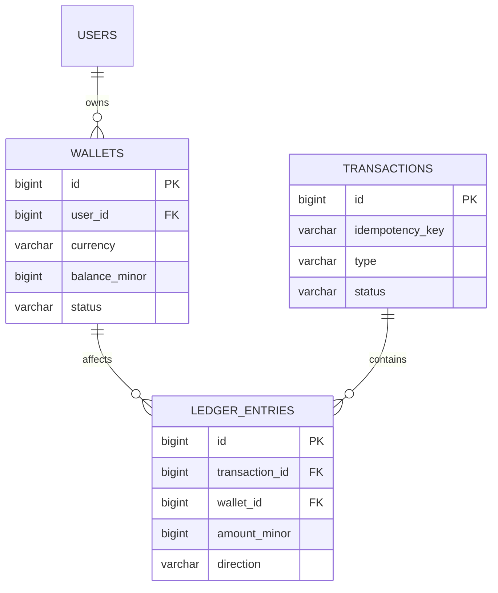

<div align="center">

# 💰 SuperWallet

### A production-grade fintech backend built from first principles

*Double-entry ledger · Idempotent transactions · Integer-precise money handling*

<br/>

[](https://www.python.org/)
[](https://fastapi.tiangolo.com/)
[](https://www.postgresql.org/)
[](https://redis.io/)
[](https://www.docker.com/)
[](LICENSE)

[](https://alembic.sqlalchemy.org/)
[](https://docs.celeryq.dev/)
[](https://github.com/features/actions)
[](CONTRIBUTING.md)

</div>

---

## 📑 Table of contents

- [Overview](#-overview)
- [Core principles](#-core-principles)
- [Tech stack](#-tech-stack)
- [Architecture](#-architecture)
- [Project structure](#-project-structure)
- [Data model](#-data-model)
- [Design decisions](#-design-decisions)
- [Getting started](#-getting-started)
- [Roadmap](#-roadmap)
- [Development philosophy](#-development-philosophy)

---

## 🔎 Overview

**SuperWallet** is a digital wallet backend built to explore how real financial systems are engineered — not by copying tutorials, but by reasoning through every architectural decision from the ground up: why a ledger exists, why money is never stored as a float, why concurrent transfers need explicit lock ordering, and why idempotency isn't optional in payment systems.

The project is being built in three deliberate stages, each fully understood and hardened before moving to the next:

| Stage | Scope | Status |
|:---:|---|:---:|
| **1️⃣ Fiat ledger** | Wallets, double-entry transactions, deposit/withdrawal/transfer | 🚧 In progress |
| **2️⃣ Card vault** | Stripe tokenization, card-funded deposits | ⏳ Planned |
| **3️⃣ Crypto wallets** | HD wallet derivation (BIP32/39/44), on-chain balance tracking | ⏳ Planned |

---

## ⚙️ Core principles

Every wallet operation in this system is designed to satisfy five invariants:

- ⚛️ **Atomicity** — a transaction either fully succeeds or fully rolls back. No partial money movement.
- 🔁 **Idempotency** — retrying the same request never double-charges or double-sends.
- ✅ **Consistency** — the cached wallet balance can never silently drift from the ledger's source of truth.
- 🧾 **Auditability** — every balance is explainable by replaying its ledger history. Nothing is ever deleted or overwritten.
- 🔢 **Decimal precision** — money is stored as integers in minor units (e.g. cents/teňňe), never as floating point, to eliminate rounding error by construction.

---

## 🧱 Tech stack

| Layer | Choice | Why |
|---|---|---|
| API framework | **FastAPI** | Async-native, dependency injection via `Depends()` |
| Database driver | **asyncpg** (raw SQL, no ORM) | Full control over query shape, locking, and transaction boundaries — critical for ledger correctness |
| Database | **PostgreSQL** | Row-level locking (`FOR UPDATE`), strong consistency guarantees |
| Background jobs | **Celery** | Reconciliation jobs, async settlement processing |
| Broker / cache | **Redis** | Currently leaning toward **Redis Streams** over RabbitMQ — sufficient for current scale, avoids premature infrastructure complexity |
| Migrations | **Alembic** | Versioned, reviewable schema history |
| Orchestration | **Docker Compose** | Local parity across services |
| CI/CD | **GitHub Actions** | Automated testing on push |

---

## 🏗️ Architecture

SuperWallet follows a **modular monolith** design — a single deployable service, internally organized by business domain rather than by technical layer.

```
Client
  │  HTTP request (with idempotency key)
  ▼
FastAPI router          → validates request shape (Pydantic)
  ▼
Service layer           → business rules: locking order, balance checks, invariants
  ▼
Repository layer        → raw SQL, one asyncpg.Connection per transaction
  ▼
PostgreSQL              → single BEGIN…COMMIT: transactions + ledger_entries + wallets
```

> **Why modular monolith over microservices, for now:** the fiat, card, and crypto domains share tight transactional correctness requirements (e.g. a card-funded deposit must atomically update both the ledger and the wallet balance). Splitting into separate services before those boundaries are proven would introduce distributed-transaction complexity without a corresponding benefit at current scale. Each domain is still developed as an isolated module (`app/fiat`, `app/cards`, `app/crypto`) so it can be extracted into its own service later with minimal rework.

---

## 📁 Project structure

```
superwallet/
├── alembic/                 # Versioned schema migrations
│   └── versions/
├── app/
│   ├── main.py               # FastAPI app assembly, router registration
│   ├── core/
│   │   ├── config.py          # Environment-based settings
│   │   ├── database.py        # Connection pool lifecycle (lifespan-managed)
│   │   └── exceptions.py      # Shared exception types
│   ├── users/
│   ├── fiat/                 # Stage 1 — double-entry ledger
│   │   ├── router.py           # HTTP layer only
│   │   ├── service.py          # Business rules (locking, invariants)
│   │   ├── repository.py       # SQL, one connection per unit of work
│   │   └── schemas.py          # Request/response contracts (Pydantic)
│   ├── cards/                # Stage 2 — not yet implemented
│   └── crypto/                # Stage 3 — not yet implemented
├── tests/
├── docker-compose.yml
└── pyproject.toml
```

Each domain owns its full vertical slice — router, service, repository, and schemas — so that changing how fiat transfers are validated never requires touching card or crypto code, and vice versa.

---

## 🗃️ Data model



- **`wallets`** — one row per (user, currency). `balance_minor` is a denormalized cache, always updated in the same transaction as its ledger entries — never independently.
- **`transactions`** — the event: what happened, its type (`deposit` / `withdrawal` / `transfer`), and its lifecycle status. Carries the `idempotency_key`.
- **`ledger_entries`** — the immutable, append-only record of money movement. Every transaction produces one or more entries; a `transfer` always produces exactly two (`debit` + `credit`), whose amounts sum to zero.

---

## 🧠 Design decisions

A few decisions worth calling out, since each was chosen over a simpler-looking alternative for a specific reason:

- 🔢 **Integer minor units, not `DECIMAL`/`float`** — storing `10050` instead of `100.50` sidesteps binary floating-point rounding error entirely (`0.1 + 0.2 !== 0.3` in IEEE 754). Arithmetic on integers is exact by construction.
- 📜 **Ledger is append-only** — balances are never edited in place. Corrections are made with a new, opposite-direction entry, preserving a complete audit trail.
- 🔐 **Idempotency keys are enforced at the database level** (`UNIQUE` constraint), not just in application code — closing the race-condition window where two near-simultaneous retries both pass an application-level check.
- 🔒 **Deterministic lock ordering for transfers** — when a transfer locks two wallet rows, it always locks the lower `id` first. This makes deadlocks between concurrent opposite-direction transfers structurally impossible, rather than something retried around.
- 🧩 **Repositories receive a single `asyncpg.Connection`, not the pool** — a transaction's `BEGIN…COMMIT` boundary must live on one connection; letting each repository call `pool.acquire()` independently makes it impossible to compose multiple writes into one atomic operation.

---

## 🚀 Getting started

```bash
git clone https://github.com/<your-username>/superwallet.git
cd superwallet

cp .env.example .env
docker compose up -d

alembic upgrade head

uvicorn app.main:app --reload
```

📚 API docs available at **`http://localhost:8000/docs`** once running.

---

## 🗺️ Roadmap

- [ ] Fiat ledger — wallet CRUD, deposit, withdrawal
- [ ] Fiat ledger — transfer with deadlock-safe locking
- [ ] Fiat ledger — balance reconciliation job (Celery)
- [ ] Card vault — Stripe tokenization, PCI-scope-free card storage
- [ ] Crypto — HD wallet derivation, address generation
- [ ] Crypto — on-chain balance synchronization

---

## 🧭 Development philosophy

This project is intentionally built slowly and deliberately — every table, every lock, every constraint is understood before it's written, not copy-pasted from a tutorial. The goal isn't just a working wallet API; it's a system whose author can explain, from first principles, why each part exists.

---

<div align="center">

<sub>Built solo, one invariant at a time. 🧱</sub>

</div>